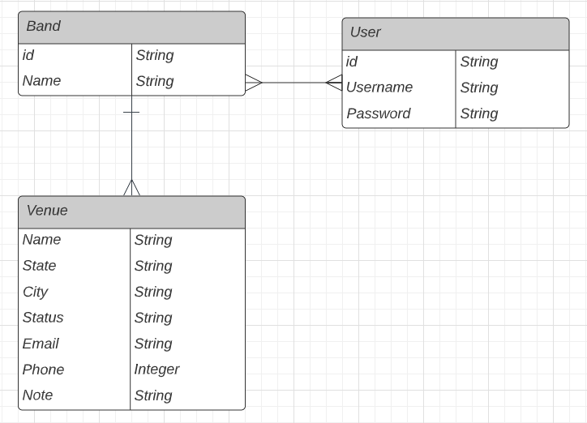
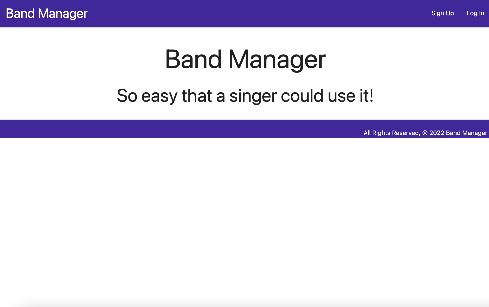
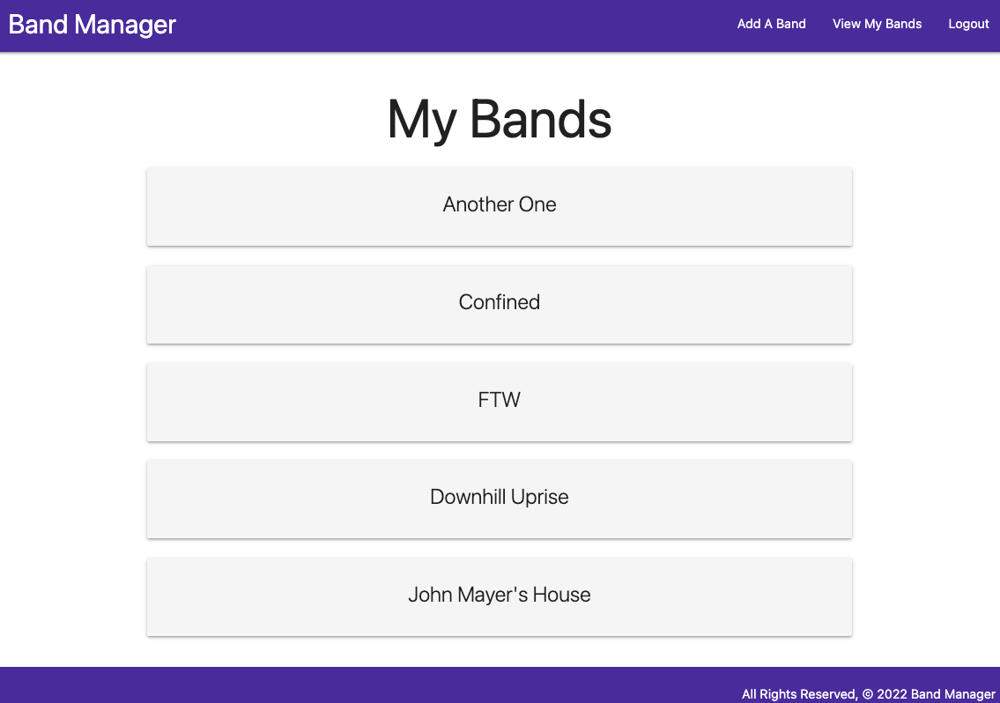
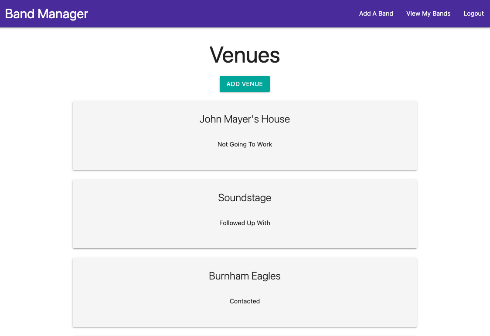
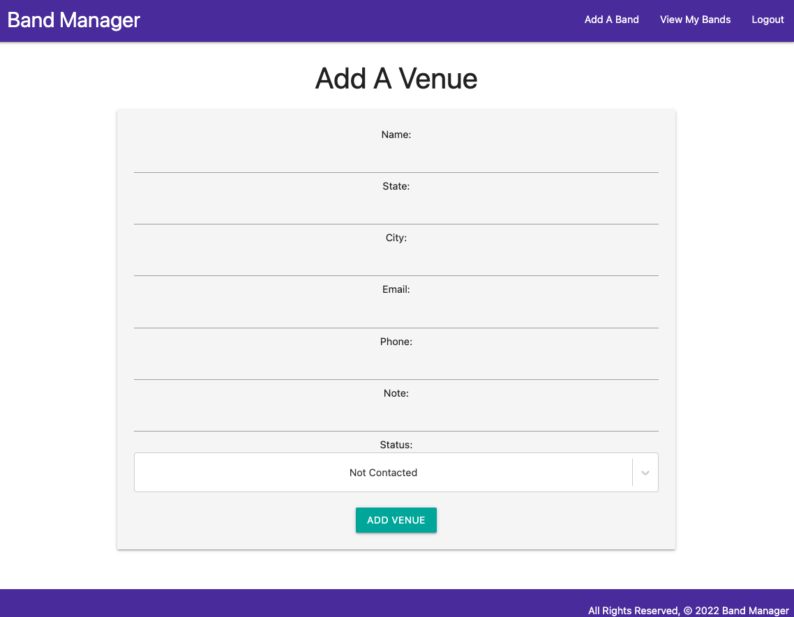

# Band Manager: *So easy that a singer could use it!*
Band Manager is a personal organization and productivity tool geared towards musicians. While online tools like Notion and Trello already let you do almost anything, Band Manager is a stupid simple and niche alternative for minimalists everywhere!

## Technologies Used
- Django REST Framework
- PostgreSQL
- Python
- React
- Materialize
- CSS
- HTML5

## Getting Started
**INSERT DEPLOYED LINK HERE**

## Next Steps/Icebox Items
[] Responsiveness for mobile UX  
[] API Functionality (Google Calendar, etc.)  
[] Gig model  
[] SongsToLearn model  
[] SetList model  
[] Calendar model  
[] Inventory model  
[] Income/Expense model  
[] WishList model (user and band)  
[] MarketingTasks model  
[] ContentCreation model  
[] Breathtaking styling  
[] Customizable color themes (and/or light/dark mode)  
[] Mass deployment (www desktop, Android store, iOS App store)  

## Wireframes & ERD
  
  
  
  

